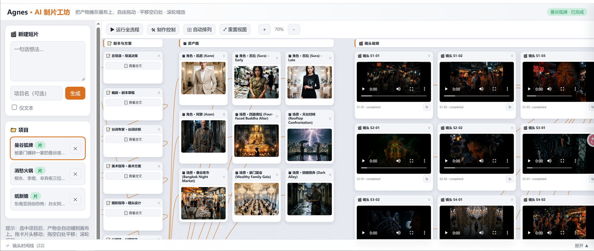

# agnes-filmmaker

一句话想法 → 11 个 AI Agent 协作 → **真实生成**图片/视频 → 拼接成片。

一个**只连接 Agnes AI** 的短片制作流水线，基于 [Agnes AI](https://agnes-ai.com/zh-Hans/docs/overview) API：文本 `agnes-2.5-flash`、图片 `agnes-image-2.1-flash`、视频 `agnes-video-v2.0`，ffmpeg 拼接。



## 快速开始

```bash
# 1. 安装依赖
pip install -r requirements.txt

# 2. 配置 API Key（复制并填入 Agnes 控制台获取的 key）
cp .env.example .env           # Windows: copy .env.example .env
#   编辑 .env：AGNES_KEY=sk-xxxxxxxx

# 3. 启动
python main.py                 # 交互模式
python main.py --pipeline      # 直接跑完整流程
python main.py --no-media      # 仅文本链路（不消耗图片/视频额度，快速调试）

# 4. Web 工作台（可选）— 画布式监制台
run_web.bat                    # Windows 一键启动（或 python -m web.app）
#   默认仅本机访问 http://127.0.0.1:8000；对外部署请在 .env 设置 ACCESS_PWD
```

> 视频拼接依赖 ffmpeg：安装到系统 PATH，或在 `config.yaml` 的 `media.ffmpeg_path` 指定路径。未安装时仍可生成各镜头视频，仅跳过最终拼接（依赖 `imageio-ffmpeg` 可自动兜底）。

## 制作流程（9 阶段）

```
剧本 → 台词诊断 → 美术定调 → 镜头设计 → 分镜脚本
→ 资产构建(出图) → 视频渲染(出片) → 后期合成(拼接) → 质控评审 → 交付
```

- **资产构建**：为每个角色/场景调用 `agnes-image-2.1-flash` 真实生成参考图并锁定（保证跨镜头一致性）。
- **视频渲染**：为每个镜头调用 `agnes-video-v2.0`（异步任务 + 轮询）真实生成视频，自动下载。
- **后期合成**：用 ffmpeg 按镜头顺序拼接为 `output/post_editor/final.mp4`。

每个阶段由专业 Agent 负责，自动从共享记忆拉取上游上下文；Gate Review 自动把关、可回退重做。

## CLI 命令

进入交互界面（`python main.py`）后：

| 命令 | 说明 |
|------|------|
| 直接输入想法 | 创建新项目 |
| `/run` | 运行当前阶段（含自动质检 + 媒体生成） |
| `/pipeline` | 跑完整 9 阶段流水线（含图片/视频/拼接） |
| `/stage <名称>` | 切换到指定阶段 |
| `/generate-video <id\|all>` | 真实生成镜头视频（`agnes-video-v2.0`） |
| `/assets` | 列出已生成的角色/场景资产图 |
| `/videos` | 列出镜头视频状态与成片 |
| `/render` | 对当前阶段执行媒体生成 |
| `/merge` | 用 ffmpeg 拼接所有镜头为 `final.mp4` |
| `/model` | 查看/切换模型（默认 Agnes） |
| `/status` `/output` `/brief` `/review` | 查看状态/产出/档案/审查 |

此外还支持 `/new` `/projects` `/templates` `/trailer` `/rollback` `/history` `/diff` `/restore` 等命令。

## 项目结构

```
agnes-filmmaker/
├── main.py              入口
├── agents/              11 个 Agent（base 运行时契约 + implementations）
├── workflow/            9 阶段流水线引擎（含媒体接入）
├── shared/              共享记忆（项目档案/产出/参考图/音色）
├── llm/                 Agnes 文本 LLM 客户端 + 定价
├── media/               Agnes 图片/视频客户端 + 执行层 + ffmpeg
├── cli/                 CLI 交互与团队编排
├── web/                 FastAPI Web 工作台（画布监制台）
├── utils/               日志/模板/预览/版本/JSON 解析
├── templates/           风格模板与各 Agent system prompt
├── docs/                文档与截图
└── config.yaml          配置（从 .example 复制）
```

## 配置（config.yaml）

```yaml
llm_providers:
  agnes: { api_key: "", base_url: https://apihub.agnes-ai.com/v1 }  # 留空读 AGNES_KEY
agents:
  director: { model: agnes-2.5-flash, provider: agnes, ... }
  # ...其余 10 个 Agent 同样默认 agnes-2.5-flash
media:
  enabled: true
  image: { model: agnes-image-2.1-flash, size: 1024x1024 }
  video:
    model: agnes-video-v2.0
    num_frames: 121        # 8n+1；121帧@24fps≈5秒
    frame_rate: 24
    concurrency: 1         # Agnes 视频限流 1次/分钟，必须为 1，否则触发 429
```

## Agnes AI 模型

本程序**只连接 Agnes AI**，文本/图片/视频全部走 [Agnes API](https://agnes-ai.com/zh-Hans/docs/overview)：

| 能力 | 模型 | 用途 |
|------|------|------|
| 文本 | `agnes-2.5-flash` | 剧本/分镜/资产/质控等全部文本 Agent（可切 `agnes-2.0-flash` / `agnes-2.5-pro-alpha`） |
| 图片 | `agnes-image-2.1-flash` | 角色/场景参考图 |
| 视频 | `agnes-video-v2.0` | 每镜头成片（异步） |

## 成本与耗时

- 文本：当前促销期 Agnes 文本 $0。
- 图片：`agnes-image-2.1-flash` 当前 $0/张。
- 视频：`agnes-video-v2.0` 当前 $0/秒，但**每镜头需数分钟**生成（异步）。全片镜头数 × 单镜头耗时即为总时长（Agnes 限流 1 次/分钟，`concurrency` 需保持为 1）；调试时可用 `--no-media` 跳过。
- 视频生成支持**断点续跑**：已完成的镜头会自动跳过。

## License

本项目基于 [MIT License](LICENSE) 开源，可自由使用、修改和分发。
